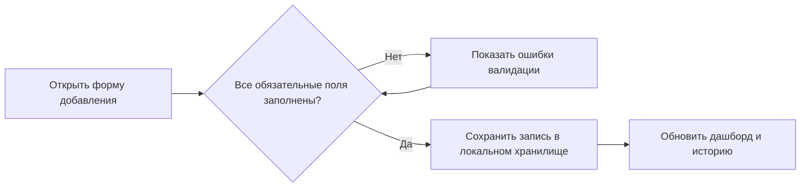
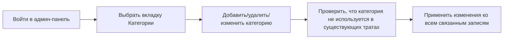

# Трекер расходов — Product Requirements Document

## 1. Обзор продукта

Приложение для персонального учёта расходов с разделением по категориям, лимитам и административной панелью для настройки справочников. Пользователь добавляет траты, выбирая категорию, тип, сумму, дату и заметки; администратор через отдельный раздел управляет категориями, типами трат, лимитами и удаляет/редактирует записи.

Целевая аудитория: люди, которые хотят контролировать бюджет вручную, без синхронизации с банками.

## 2. Основной функционал

### 2.1 Роли пользователей

| Роль | Способ входа | Основные права |
|------|--------------|----------------|
| Пользователь | Локальное использование без пароля | Добавление, просмотр, редактирование и удаление своих расходов; просмотр статистики |
| Администратор | Переключатель режима внутри приложения | Управление категориями, типами трат, лимитами по категориям; массовое удаление записей |

### 2.2 Модули приложения

1. **Дашборд**: сводка расходов, текущие лимиты, график по категориям, последние операции.
2. **История расходов**: фильтруемый список всех трат с редактированием и удалением.
3. **Добавление расхода**: форма с выбором категории, типа, суммы, даты и заметки.
4. **Админ-панель**: управление категориями, типами трат, лимитами, кнопка сброса данных.
5. **Настройки**: переключение светлой/тёмной темы (по умолчанию тёмная), выбор валюты, сброс всех данных.

### 2.3 Описание страниц

| Страница | Модуль | Описание функционала |
|----------|--------|----------------------|
| Дашборд | Сводка | Карточки: расход за день, неделю, месяц; круговая диаграмма по категориям; список последних 5 трат |
| История | Список | Таблица/карточки с фильтрами по категории, дате, сумме; кнопки редактировать/удалить |
| Добавить | Форма | Поля: категория (select), тип (select), сумма (number), дата, заметка; валидация обязательных полей |
| Админ | Управление | Вкладки: категории, типы трат, лимиты; добавление/удаление/редактирование каждого элемента |
| Настройки | Предпочтения | Переключатель темы, валюты, кнопка «Очистить все данные» |

## 3. Основные сценарии

### 3.1 Добавление нового расхода

### 3.2 Управление категорией через админку

## 4. Дизайн интерфейса

### 4.1 Стиль

- **Концепция**: «Dark Apple» — глубокий тёмный фон, стеклянные панели, крупная типографика, плавные анимации, минимум декора.
- **Палитра**:
  - Фон: `#050505`
  - Поверхность: `#0f0f10`, `#151517`
  - Границы: `rgba(255, 255, 255, 0.08)`
  - Основной текст: `#f5f5f7`
  - Вторичный текст: `#a1a1a6`
  - Акцент: `#2997ff` (синий Apple)
  - Акцент-hover: `#5ac8fa`
  - Предупреждение/лимит превышен: `#ff375f`
  - Успех: `#30d158`
- **Типографика**: заголовки — Georgia или serif-альтернатива для элегантности; интерфейс — SF Pro Display / system-ui.
- **Кнопки**: закругление 12 px, тонкая граница, полупрозрачный фон, свечение при наведении.
- **Карточки**: border-radius 20 px, blur-фон, тонкая граница, тень с мягким размытием.
- **Иконки**: Lucide React.

### 4.2 Обзор страниц

| Страница | Модуль | UI-элементы |
|----------|--------|-------------|
| Дашборд | Сводка | Hero-заголовок, карточки метрик, donut-chart, список последних трат |
| История | Список | Фильтры сверху, карточки трат с датой, категорией, суммой, действиями |
| Добавить | Форма | Два столбца на десктопе: поля слева, превью карточки справа |
| Админ | Управление | Вкладки, список элементов с inline-редактированием, форма добавления |
| Настройки | Предпочтения | Тогглы, селектор валюты, опасная зона сброса |

### 4.3 Адаптивность

- Десктоп-first (1440 px базовая сетка).
- Планшет: две колонки превращаются в одну, боковое меню сворачивается в нижнюю панель.
- Мобильный: нижняя навигация, карточки во всю ширину, форма в один столбец.

### 4.4 Анимации

- Появление страницы: fade-in + translateY(12 px) с задержкой по группам.
- Наведение на карточки: увеличение scale(1.01), усиление тени.
- Кнопки: мягкое свечение акцента при hover.
- Диаграммы: анимированное заполнение сегментов.
- Добавление/удаление записи: slide-in / slide-out.
