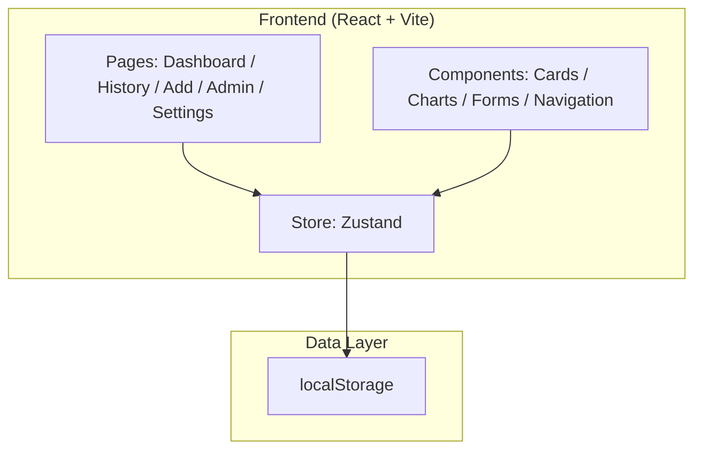
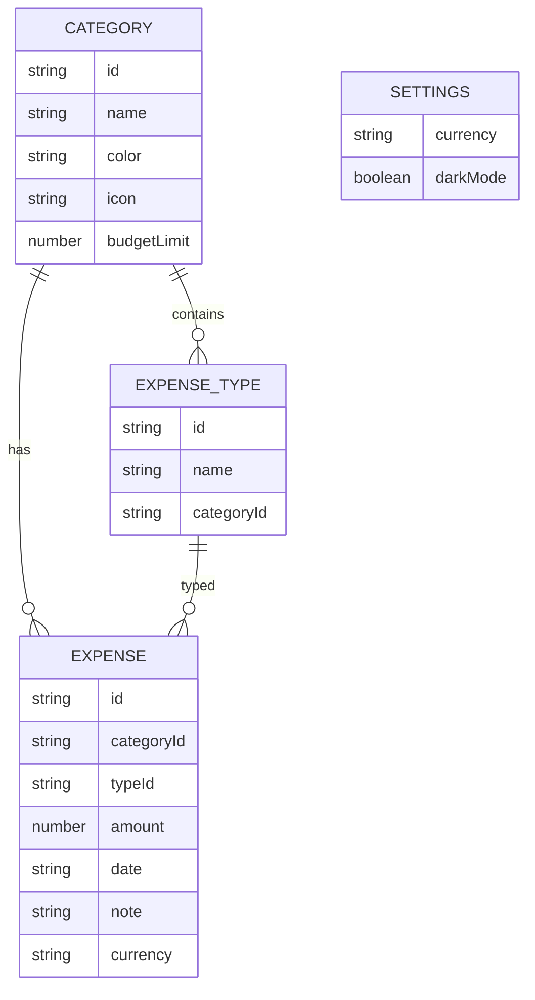

# Трекер расходов — Техническая архитектура

## 1. Архитектура



## 2. Технологии

- **Frontend**: React 18 + TypeScript + Vite
- **Стили**: Tailwind CSS 3
- **Иконки**: lucide-react
- **Графики**: recharts
- **Управление состоянием**: zustand
- **Хранение данных**: localStorage (без backend)
- **Инициализация**: vite-init, шаблон react-ts

## 3. Маршруты

| Маршрут | Назначение |
|---------|------------|
| / | Дашборд |
| /history | История расходов |
| /add | Добавить расход |
| /admin | Админ-панель |
| /settings | Настройки |

## 4. Модель данных

### 4.1 ER-диаграмма



### 4.2 TypeScript-типы

```typescript
interface Category {
  id: string;
  name: string;
  color: string;
  icon: string;
  budgetLimit: number;
}

interface ExpenseType {
  id: string;
  name: string;
  categoryId: string;
}

interface Expense {
  id: string;
  categoryId: string;
  typeId: string;
  amount: number;
  date: string; // ISO YYYY-MM-DD
  note: string;
  currency: string;
}

interface Settings {
  currency: '₽' | '$' | '€' | '₸';
  darkMode: boolean;
}
```

### 4.3 Начальные данные

Категории по умолчанию:
- Продукты (`#30d158`)
- Транспорт (`#2997ff`)
- Развлечения (`#ff375f`)
- Здоровье (`#af52de`)
- Жильё (`#ff9500`)
- Одежда (`#5ac8fa`)
- Прочее (`#8e8e93`)

Типы расходов по умолчанию привязаны к категориям, например:
- Продукты: Супермаркет, Ресторан, Доставка
- Транспорт: Такси, Метро, Бензин
- Развлечения: Кино, Игры, Подписки

## 5. Хранилище (Zustand)

```typescript
interface AppState {
  expenses: Expense[];
  categories: Category[];
  types: ExpenseType[];
  settings: Settings;
  addExpense: (expense: Omit<Expense, 'id'>) => void;
  updateExpense: (id: string, data: Partial<Expense>) => void;
  deleteExpense: (id: string) => void;
  addCategory: (category: Omit<Category, 'id'>) => void;
  updateCategory: (id: string, data: Partial<Category>) => void;
  deleteCategory: (id: string) => void;
  addType: (type: Omit<ExpenseType, 'id'>) => void;
  updateType: (id: string, data: Partial<ExpenseType>) => void;
  deleteType: (id: string) => void;
  updateSettings: (settings: Partial<Settings>) => void;
  resetAll: () => void;
}
```

## 6. Правила бизнес-логики

- Нельзя удалить категорию, пока на неё ссылаются расходы. При удалении категории все связанные типы трат удаляются автоматически.
- При редактировании категории все существующие расходы обновляются по новому `categoryId`.
- При превышении лимита категории на дашборде отображается предупреждение.
- Все суммы форматируются согласно выбранной валюте.
